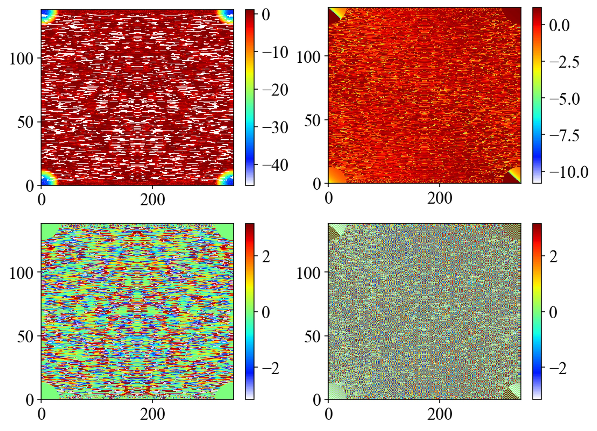

## 自定义FFT卷积

使用fftshift(fft(fftshift(signal))):

1.不改变频谱的幅度和相位

2.使得频谱的范围为-Fs/2到Fs/2，中心频率为0

```python

def fftconvolve(im, gauss_kernel):
    gauss_f = np.fft.fftshift(np.fft.fft2(np.fft.fftshift(gauss_kernel)))
    #plotFreq(x, y, np.log(np.abs(gauss_f)).T)
    #plotFreq(x, y, np.log(np.angle(gauss_f)).T)
    im_r = np.fft.fftshift(np.fft.fft2(np.fft.fftshift(im)))
    #plotField(x, y, np.log(np.abs(im_r)).T)
    #plotFreq(x, y, np.log(np.angle(im_r)).T)
    im_filter = np.fft.ifftshift(np.fft.ifft2(np.fft.ifftshift(gauss_f * im_r))).real
    #plotField(x, y, im_filter.T)
    return im_filter

im_filter = fftconvolve(im, gauss_kernel)

```

只改变gauss_kernal的fft也可以得到相同的结果

```python

def fftconvolve(im, gauss_kernel):
    gauss_f = np.fft.fftshift(np.fft.fft2(np.fft.fftshift(gauss_kernel)))
    #plotFreq(x, y, np.log(np.abs(gauss_f)).T)
    #plotFreq(x, y, np.log(np.angle(gauss_f)).T)
    im_r = np.fft.fftshift(np.fft.fft2(np.fft.fftshift(im)))
    #plotField(x, y, np.log(np.abs(im_r)).T)
    #plotFreq(x, y, np.log(np.angle(im_r)).T)
    im_filter = np.fft.ifftshift(np.fft.ifft2(np.fft.ifftshift(gauss_f * im_r))).real
    #plotField(x, y, im_filter.T)
    return im_filter

im_filter = fftconvolve(im, gauss_kernel)

```



使用fftshift和不适用fftshift的相位角对比。
